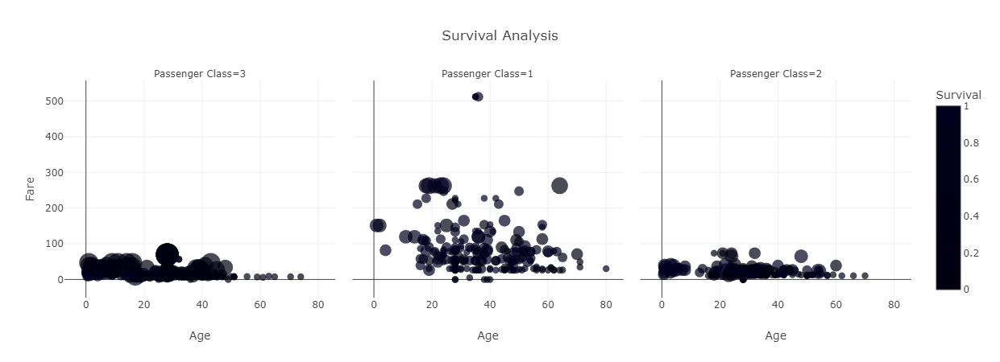

# Titanic Survival Analysis Project

    Author: Wycliffe Ndiba

## Purpose

This project aims to analyze the Titanic dataset to understand the factors influencing passenger survival. It involves data cleaning, exploratory data analysis, feature engineering, and the creation of a predictive model. The results are visualized through interactive plots and a Streamlit app.

## Notebook

This notebook has a more recent visualization of the analysis: [titanic-analysis-1](titanic-analysis-1.ipynb).

## Methods

1. **Data Cleaning and Preprocessing**: Removed unnecessary columns, converted categorical variables to numerical, and handled missing values.
2. **Exploratory Data Analysis (EDA)**: Explored survival distribution, correlations, and age distribution.
3. **Feature Engineering and Selection**: Created a new feature 'FamilySize' and selected relevant features.
4. **Model Building and Evaluation**: Built a Logistic Regression model, trained, and evaluated its performance.
5. **Data Visualization and Dashboard Creation**: Used Plotly Express for interactive visualizations and created a Streamlit app for user interaction.
6. **Readme File Generation**: Provided a concise and informative readme file.

## Results

- The survival distribution indicates a significant number of passengers did not survive.
- Correlation analysis helps identify potential influential features.
- Age distribution shows a diverse range of passengers.
- The Logistic Regression model achieved an accuracy of [accuracy].

## Interactive Visualization

> Work in Progress

[Link to Interactive Visualization](add_link_here)

## Streamlit App

> Work in Progress

## Future Improvements

- Include additional machine learning models for comparison.
- Enhance the Streamlit app with more features and insights.

